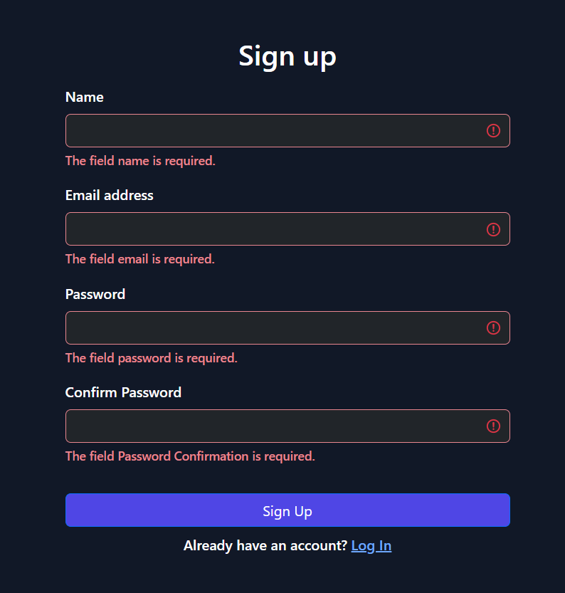
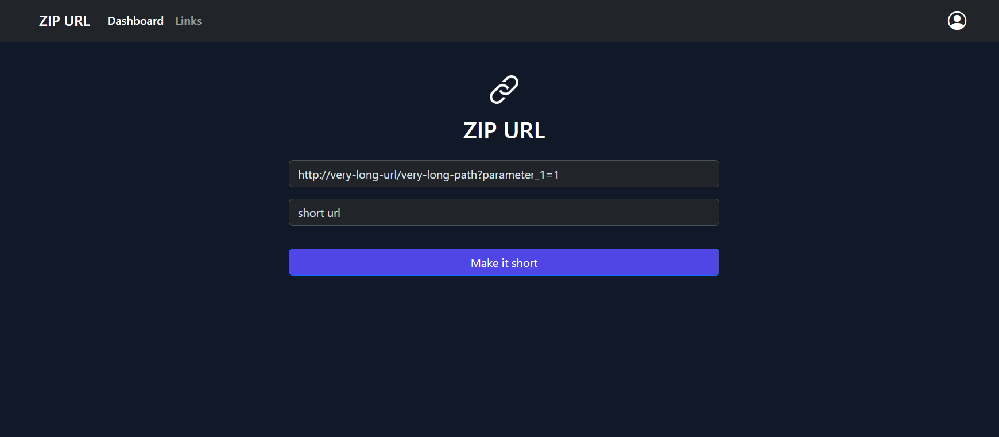
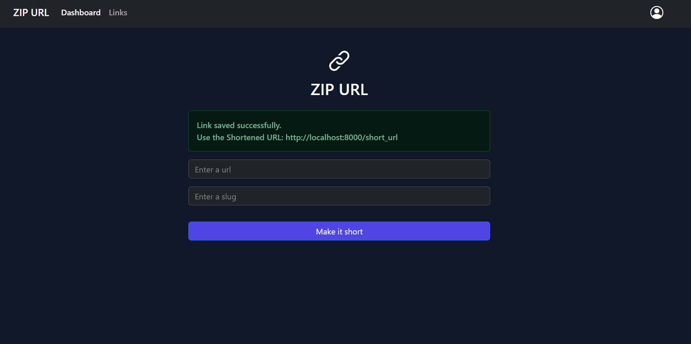
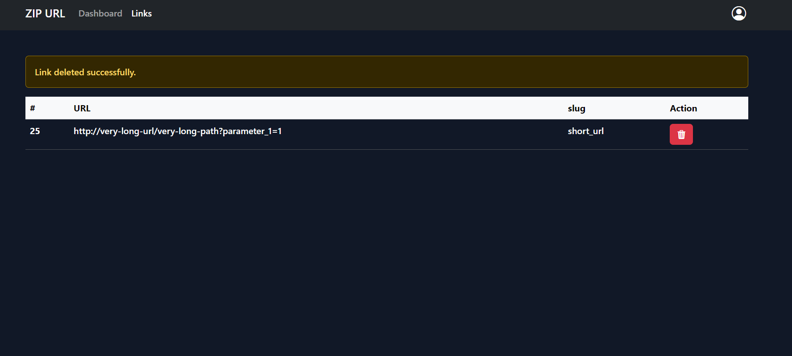

## ZIP URL

PHP-MVC project aimed at creating and managing short URLs, leveraging the Model-View-Controller (MVC) architectural pattern.

## Installation

```shell
   # Clone the project
   git clone https://github.com/MajdSoubh/ZIP-URL.git

   # Install dependencies
   composer install

   # Create .env file with your configurations
   cp .env.example .env

   # Enter public directroy
   cd public

   # Start the server
   php -S localhost:8000
```

## MVC Features

- Implemented a robust routing system that efficiently maps incoming requests to the appropriate controllers, enabling seamless navigation and URL handling.

- Implemented authentication and authorization features to secure the application, allowing only authorized users to create and manage short URLs.

- Employing token-based CSRF protection and preventing session hijacking.

## Screen Shots

<p align="center">




</p>
